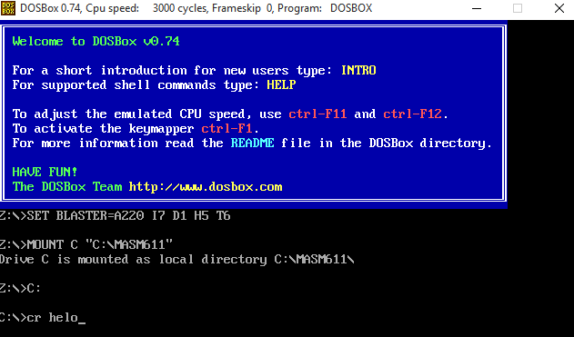
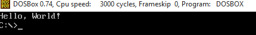

# Ensamblador portable
Ensamblador Windows (Pronto linux, mac)

### Herramientas
* Dosbox [https://www.dosbox.com/](https://www.dosbox.com/)
* Masm [http://www.masm32.com/](http://www.masm32.com/)
* Bat To Exe [http://www.f2ko.de/en/ob2e.php](http://www.f2ko.de/en/ob2e.php)

## Instrucciones de uso

### 1. Abrir Dos.exe


### 2. Ensamblar y ejecutar
> Nota: En el ejemplo el archivo se llama `helo.asm` y se encuentra en la carpeta Projects



### 3. Resultado


ERRORES
=======
**fatal error A1000: cannot open file : ...**
```
Reparar cambiando nombre al archivo compilando (recomendado a.asm)
```
